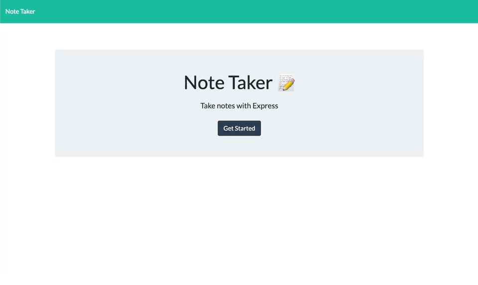

# Note Taker App

## Description

This application allows the user to write, save, and delete text notes. When saved, the note is added to a backend json file and will be added to the past notes column on the left side of the screen. It will also automatically load on page load. And when deleted the note is removed from the json file. 

Coding the backend of this application taught me a lot about routes (especially delete and post) and how to line up the backend with the frontend to create a fully functional app. 

## Installation

To install this application's code on your own device, clone the repo and open in your favorite code editor. 

## Usage

When active a user can simply click through the landing page to the notes page where they will be greated with any previous notes they created as well as a space to write new notes. They are also given the option to delete any previous notes. 

For an example of the functonality see the demo below. 

   

You can view a live version of the application here on Heroku: 

## Credits

Frontend code provided by University of Denver Fullstack Bootcamp Course.

## Features

This application features the following functionality: 
- Ability to load past saved notes on page load. 
- Ability to create new notes and save them for later viewing.
- Ability to delete previously saved notes. 
